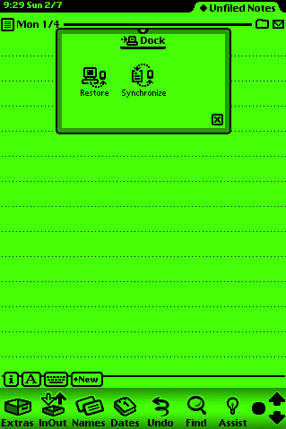

# 

# newton-sync

NewtonSync is a NodeJS library. Its goal is to make possible communicate with Apple Newton PDA devices from Node applications using Dock Connection Protocol . It provides modules to manage Dock Session, and read/write information from device such as contacts, notes or appointments.
 
## Motivation

Newton OS and Newton devices are very interesting from a technical view. Ahead of their time, they still do a great service, but they usually need a computer at home or office to save or backup data. A this time there are good alternatives to sync in actual computers but only will backup data, and import/export process is manual.
Synchronizing with a NodeJS based service will bring new sync opportunities to other cloud services and take NewtonOS 'back to the future'.

## Installation

```
$ npm install --save newton-sync
```

## Main Features
- NCU TCP Server
- Session negotiation
- Send/receive dock commands
- Get device info
- Read/write soup data **(not yet)**

[Dante is the Connection protocol](media/Dock Protocol.pdf) is used to communicate between the desktop and Newton. This library will handle and parse Newton event commands and serve high level commands to communicate with Newton in order to import/export data. 

**This is work in progress**. At this time it handles communication via TCP/IP port 3679 for command exchange. This requires a internet enabled Newton and [Dock TCP Package](http://www.kallisys.com/) installed in order to connect:

Serial communication will be tested when basic sync is achieved. For now it 'only' negotiates a new dock session with a device and exchange necessary commands to get dock icons showed at Newton screen.

## Usage

At this point is a bit early to use this npm package in other project. When it is, it's usage will be:

```js
NewtonSync = require('newton-sync');

ncuServer = new NewtonSync.NcuServer();
```
However, it's possible to run a NCU Server and try features running:

```
$ grunt server
```

## Tests

Tested with [Einstein emulator](https://github.com/pguyot/Einstein) and a physical Newton 2100 device with [PCMCIA LAN adapter](http://newtonsales.com/newt.htm).
Unit test available via:
```
$ grunt test
```

## license

Copyright (c) 2016, Txomin Jimenez

Permission to use, copy, modify, and/or distribute this software for any purpose with or without fee is hereby granted, provided that the above copyright notice and this permission notice appear in all copies.

THE SOFTWARE IS PROVIDED "AS IS" AND THE AUTHOR DISCLAIMS ALL WARRANTIES WITH REGARD TO THIS SOFTWARE INCLUDING ALL IMPLIED WARRANTIES OF MERCHANTABILITY AND FITNESS. IN NO EVENT SHALL THE AUTHOR BE LIABLE FOR ANY SPECIAL, DIRECT, INDIRECT, OR CONSEQUENTIAL DAMAGES OR ANY DAMAGES WHATSOEVER RESULTING FROM LOSS OF USE, DATA OR PROFITS, WHETHER IN AN ACTION OF CONTRACT, NEGLIGENCE OR OTHER TORTIOUS ACTION, ARISING OUT OF OR IN CONNECTION WITH THE USE OR PERFORMANCE OF THIS SOFTWARE.
